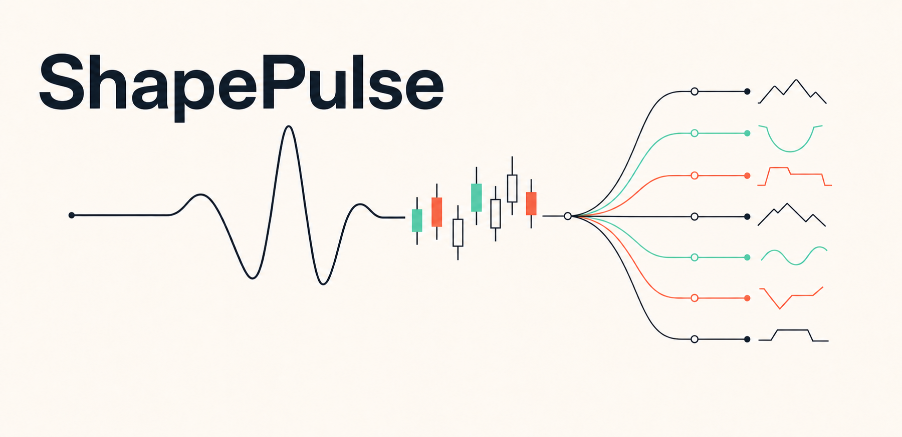
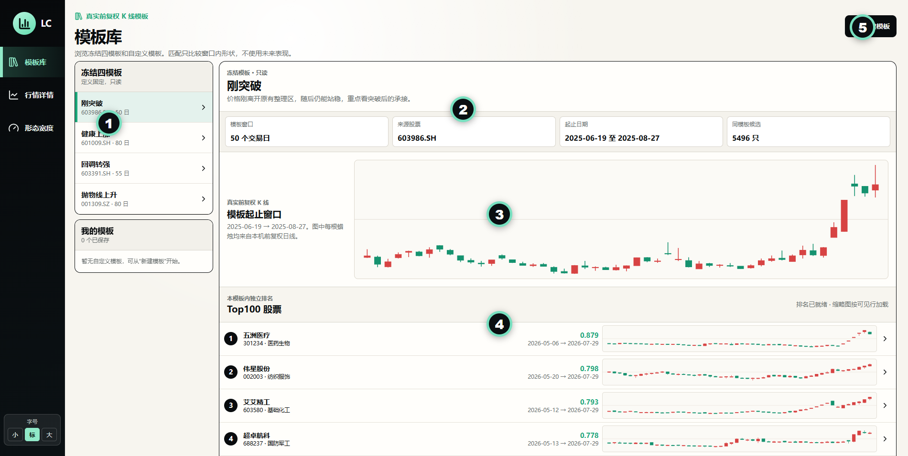
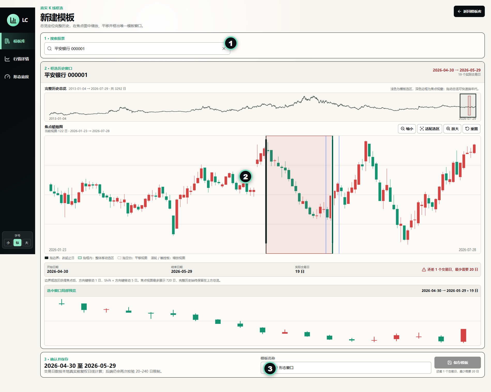
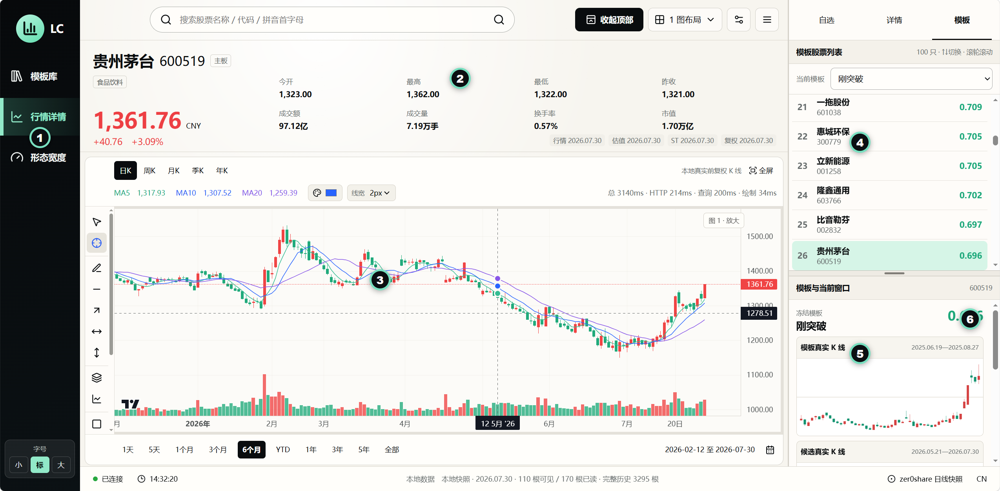
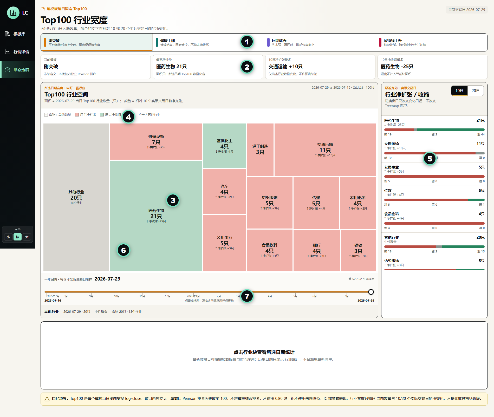

<div align="center">

**本地 A 股形态研究台**

用真实 K 线定义形态模板，寻找相似股票，并观察 Top100 在行业中的扩张与收缩。

`V2.7.1` · `Windows` · `Local-first` · `MIT`



[设计动机](#设计动机与研究假设) · [功能预览](#功能预览) · [三分钟启动](#三分钟启动) · [页面入口](#页面入口) · [如何解读](#如何解读) · [数据边界](#数据与隐私边界)

</div>

---

ShapePulse 是一个在本机运行的 A 股形态研究工作台。它把三个原本分散的观察动作放在一起：

1. 从真实历史 K 线中定义一个形态模板；
2. 在全市场寻找当前窗口与模板相似的股票；
3. 观察每个模板 Top100 正在集中到哪些行业，以及这些行业正在扩张还是收缩。

ShapePulse 不连接券商、不执行交易，也不把相似度解释成未来收益。它更像一张“市场形态地图”：帮助研究者把个股形态、候选排名与行业广度放在同一个上下文里阅读。

> [!IMPORTANT]
> 本项目仅供学习、研究与信息展示，不构成投资建议。相似度、Top100 和行业宽度均为描述性指标，不代表价格预测或交易信号。

## 设计动机与研究假设

ShapePulse 受到价格周期与波浪理论中“走势具有阶段性”的启发，但不尝试把每只股票严格套入固定浪型。它采用一个更朴素的价格行为假设：价格已经吸收了大量市场信息，而对以价格为主要依据的手工研究者来说，最值得优先观察的通常是刚刚突破或正处于上涨结构中的股票。

四个内置模板分别对应刚突破、趋势延续、回调后转强和斜率加速。它们可以被理解为一段上涨周期中可能出现的不同状态，但不是要求所有资产依次完成的机械路径。什么形态值得研究也因人而异，因此系统同时允许用户从真实历史 K 线中创建自己的模板，并在实际使用中持续检验。

在方法上，相似 K 线更适合作为**低成本粗筛**，而不是最终推荐：先用较少的价格特征从全市场召回一个较小的候选池，再接入基本面、行业、流动性、风险或其他因子进行精排。这与推荐系统的“召回 → 精排”以及多因子选股的分层思路相近，目标是减少噪音和后续计算范围，而不是仅凭相似度得出交易结论。

进一步地，ShapePulse 将每个模板的 Top100 按行业聚合，希望用价格形态的行业宽度描述市场状态及其时间变化。目前的初步观察是：“刚突破”对短期强势行业的变化更敏感；其余三个趋势型模板相关性较高，反映的行业强度更持续、但也相对滞后。两类信号结合后，可能有助于观察行业状态的新旧切换。这些仍是待验证的研究发现，后续会以实证报告补充完整证据。

## 功能预览

| 模块 | 可以做什么 | 核心问题 |
| --- | --- | --- |
| 模板库 | 浏览四个冻结模板和自己创建的模板 | 我想研究的是哪一种价格形态？ |
| 新建模板 | 从任意股票完整历史中框选 20～240 个交易日 | 我能否用一段真实 K 线表达自己的观察？ |
| 行情详情 | 查看个股 K 线、模板 Top100、候选窗口与相似度 | 这只股票与模板到底像在哪里？ |
| 形态宽度 | 查看 Top100 的申万一级行业分布、10/20 日变化与一年时间线 | 某类形态正在向哪些行业扩散或退潮？ |

### 四个内置冻结模板

| 模板 | 窗口 | 研究含义 |
| --- | ---: | --- |
| 刚突破 | 50 个交易日 | 价格刚离开原有整理区，随后仍能站稳，重点观察突破后的承接 |
| 健康上涨 | 80 个交易日 | 结构抬高、回撤受控，关注趋势的连续性而非单日涨幅 |
| 回调转强 | 55 个交易日 | 先走强、再回吐，随后恢复向上，关注回调后的重新确认 |
| 抛物线上升 | 80 个交易日 | 前段较缓、后段斜率明显放大，用于识别加速形态 |

冻结模板用于提供稳定的共同观察基准，只读、不被日常操作改写。自定义模板保存在本机，适合记录个人研究假设。

## 界面图解

### 1. 模板库



| 图中区域 | 怎么用 |
| --- | --- |
| ① 左侧模板列表 | 在四个冻结模板与“我的模板”之间切换 |
| ② 模板事实卡 | 查看模板来源股票、起止日期、窗口长度和同模板候选数量 |
| ③ 模板真实 K 线 | 模板不是手绘曲线，而是来自本地前复权日线的真实窗口 |
| ④ Top100 股票 | 每个模板独立排名；点击任意候选可进入行情详情继续对照 |
| ⑤ 新建模板 | 进入完整历史框选流程，保存自己的形态窗口 |

### 2. 新建模板



创建流程只有三步：

1. 搜索并选择一只股票；
2. 在完整历史总览中定位，在焦点图中缩放、平移并框选唯一窗口；
3. 将窗口调整到 20～240 个交易日，命名并保存。

总览负责定位完整历史，焦点图负责精确选择。边界或选区获得焦点后，可用方向键移动 1 个交易日，按住 `Shift` 时移动 5 个交易日。

### 3. 行情详情



| 图中区域 | 怎么看 |
| --- | --- |
| ① 左侧导航 | 在模板库、行情详情和形态宽度之间切换 |
| ② 顶部行情摘要 | 查看股票、价格、涨跌幅、成交、市值，以及行情/估值/ST/复权各自的数据日期 |
| ③ 中央 K 线 | 切换日、周、月、季、年周期，缩放历史，并使用绘图工具进行人工标注 |
| ④ 右上模板票池 | 显示当前模板 Top100；支持鼠标选择、方向键连续换股和滚轮浏览 |
| ⑤ 右下模板对照 | 同时查看模板真实 K 线与候选真实窗口，不只看一个分数 |
| ⑥ 相似度 | 只描述两个标准化窗口的形状接近程度；应结合起止位置和真实 K 线判断 |

### 4. Top100 行业宽度



| 图中区域 | 怎么看 |
| --- | --- |
| ① 顶部模板标签 | 切换刚突破、健康上涨、回调转强和抛物线上升；每个模板每日固定 Top100 |
| ② 摘要卡 | 快速识别最宽行业，以及 10 日净扩张、净收缩最明显的行业 |
| ③ 行业空间 | 矩形面积只由当前 Top100 中该行业的股票数量决定 |
| ④ 颜色 | 表示相对 10 或 20 个实际交易日前的净变化，不表示涨跌预测 |
| ⑤ 净扩张/收缩 | 拆分新进入、继续留存和退出 Top100 的股票数量 |
| ⑥ 行业点击 | 点击行业块后再读取股票明细与时间序列，首屏不会加载全部重数据 |
| ⑦ 一年时间线 | 点击或拖动滑块回看一年，每 5 个实际交易日采样；左右方向键可逐点移动 |

## 如何解读

### 模板相似度

V2.7.1 使用以下口径比较模板与候选窗口：

```text
前复权收盘价
    ↓
取 log-close
    ↓
模板窗口与候选窗口分别做 z-score 标准化
    ↓
按单个窗口计算 Pearson 相似度
    ↓
在每个模板内部独立排序
```

- 相似度越高，只表示两个窗口的走势形状越接近；
- 不同模板的窗口长度和形状不同，分数不建议直接横向比较；
- Top100 是每个模板自己的前 100 名，不是四个模板混排；
- 计算不使用未来收益、IC 或策略表现；
- 相似度不是形态所处阶段的自动判断，需要结合两张真实 K 线阅读。

### 行业宽度

行业宽度回答的是“这种形态现在出现在哪里”，不是“哪个行业接下来会涨”。

- **面积**：当前 Top100 中该行业的股票数量；
- **新**：对比日前不在 Top100、当前进入 Top100；
- **留**：对比日与当前都在 Top100；
- **退**：对比日在 Top100、当前已经退出；
- **净变化**：`新进入数量 - 退出数量`；
- **10 日 / 20 日**：10 或 20 个真实交易日前，不是自然日。

一个行业面积很大但持续净收缩，表示它仍有较多候选，但形态覆盖正在退潮；面积暂时不大但连续净扩张，则表示该形态正在向这个行业扩散。两者都只是研究线索。

## 三分钟启动

### 环境要求

- Windows 10/11（V2.7.1 当前优先支持）
- Node.js `>= 22.13.0`
- pnpm
- Python `>= 3.11`
- [uv](https://docs.astral.sh/uv/)
- Tushare Pro Token
- 本地 [zer0share](https://github.com/zer0quant/zer0share) 数据仓库

完整使用 `stock_st` 等数据建议 Tushare 积分不低于 3000。具体权限和积分要求以 Tushare 与 zer0share 的最新说明为准。

### 第一步：准备 zer0share

```powershell
git clone https://github.com/zer0quant/zer0share.git
Set-Location .\zer0share
uv sync
Copy-Item .\config\settings.example.toml .\config\settings.toml
```

打开 `config/settings.toml`，在本机填写自己的 Token：

```toml
[tushare]
token = "your_tushare_token_here"
```

> [!CAUTION]
> 不要把真实 Token 写进 ShapePulse，也不要把 `settings.toml` 或其他密钥文件提交到公开仓库。

### 第二步：同步最低必需数据

按下面顺序执行：

```powershell
uv run python main.py sync --table trade_cal
uv run python main.py sync --table basic
uv run python main.py sync --table daily_kline
uv run python main.py sync --table adj_factor
uv run python main.py sync --table daily_basic
uv run python main.py sync --table stock_st
uv run python main.py sync --table industry
uv run python main.py status
```

也可以使用 `uv run python main.py sync --all` 同步 zer0share 的全部数据，但耗时、网络请求和 Tushare 权限要求会更高。

ShapePulse 当前使用的数据口径：

| 用途 | zer0share 本地数据 |
| --- | --- |
| 股票搜索与基础信息 | `stock/basic` |
| 日线与成交量 | `stock/daily_kline` |
| 前复权 | `stock/adj_factor` |
| 市值、换手率和估值 | `stock/daily_basic` |
| ST 状态 | `stock/stock_st` |
| 申万行业 | `stock/industry/sw_member` |

### 第三步：安装 ShapePulse

```powershell
git clone https://github.com/yangxiamike/shapepulse.git
Set-Location .\shapepulse
pnpm install --frozen-lockfile
```

### 第四步：一键启动

推荐在 ShapePulse 项目目录运行：

```powershell
$env:ZER0SHARE_ROOT = 'D:\path\to\zer0share'
powershell -ExecutionPolicy Bypass -File .\scripts\start_app.ps1
```

脚本会启动本地数据服务与 V2.7.1 前端，检查当前端口是否误开了不含时间线的旧版本，并默认打开：

[http://localhost:3000/template-breadth-v3](http://localhost:3000/template-breadth-v3)

如果没有设置 `ZER0SHARE_ROOT`，脚本还会尝试查找当前用户 `Documents\zer0share` 或与 ShapePulse 同级的 `zer0share` 目录。

### 分开启动：本地数据服务

在第一个 PowerShell 窗口中，将路径替换为自己的 zer0share 目录：

```powershell
Set-Location .\shapepulse
$env:ZER0SHARE_ROOT = 'D:\path\to\zer0share'
$env:ZER0SHARE_CONFIG = Join-Path $env:ZER0SHARE_ROOT 'config\settings.toml'
uv run --project $env:ZER0SHARE_ROOT python -m server --port 8765
```

### 分开启动：页面

在第二个 PowerShell 窗口中运行：

```powershell
Set-Location .\shapepulse
pnpm dev
```

打开 [http://localhost:3000/templates](http://localhost:3000/templates)。

### 检查数据日期

启动后运行：

```powershell
(Invoke-RestMethod 'http://127.0.0.1:8765/api/health').snapshots
```

返回值会分别显示行情、估值、ST 和复权数据的最新本地日期。ShapePulse 不会为了让日期看起来一致而静默补数或丢弃较新的 K 线。

## 页面入口

| 页面 | 本地地址 | 使用场景 |
| --- | --- | --- |
| 模板库 | [localhost:3000/templates](http://localhost:3000/templates) | 浏览模板与 Top100 |
| 新建模板 | [localhost:3000/templates/new](http://localhost:3000/templates/new) | 从完整历史中框选自定义模板 |
| 行情详情 | [localhost:3000/market](http://localhost:3000/market) | 搜索股票、查看 K 线和模板对照 |
| 形态宽度 | [localhost:3000/template-breadth-v3](http://localhost:3000/template-breadth-v3) | 默认入口，拖动一年时间线查看 Top100 行业空间与变化 |
| 后端健康检查 | [127.0.0.1:8765/api/health](http://127.0.0.1:8765/api/health) | 检查数据路径、快照日期与连接状态 |

根路径 `/` 会进入模板库。

## 数据与隐私边界

- ShapePulse 页面运行时只读取本地 zer0share Parquet/DuckDB 数据；
- Tushare 网络请求只发生在用户主动执行 zer0share 同步时；
- ShapePulse 不在线补数，也不会回退到其他行情源；
- Tushare Token 只应保存在 zer0share 本地配置中；
- 自定义模板、自选和人工状态保存在项目本地 SQLite；
- 行情数据和 Token 均不随本仓库分发。

V2.7.1 仓库内的 `public/template-breadth-v3*.json`、`public/template-breadth-v3-timelines/` 与 `public/template-rankings/` 是随版本提供的研究快照。行情详情读取用户自己的 zer0share；如需用自己的最新数据重新生成完整 Top100 宽度快照，当前研究脚本仍需要按本机路径做适配。这是 V2.7.1 的已知边界。

## 当前限制

- Windows 为当前主要验证平台，Linux/macOS 尚未完成同等级验收；
- 完整研究体验以桌面端为主，窄屏适合查看和基础操作；
- 只提供日线及其周/月/季/年聚合，不提供分时和分钟线；
- 不提供自动交易、回测、预警、收益预测和荐股；
- 不提供通用指标库、因子分析或多股票叠加比较；
- V2.7.1 的模板 Top100 当前使用固定的全 A 活跃候选截面（沪深北，未显式剔除 ST），尚不能在界面中按市值、申万行业、ST 状态、板块，或沪深300/中证500/中证1000等指数成分池限定候选范围；
- 旧版综合筛选曾提供部分股票池过滤能力，但尚未接入 V2.7.1 的模板召回与排序流程。欢迎使用者按自己的研究口径扩展候选池过滤层和后续因子精排；
- 布局持久化和公开的一键数据重建流程仍在开发中。

## 项目结构

```text
app/        前端页面与交互组件
server/     本地 Python 数据服务与 SQLite 状态
config/     形态阈值和冻结模板定义
public/     V2.7.1 随版本提供的 Top100 排名与一年行业时间线快照
scripts/    数据研究、构建与验证脚本
docs/       验收记录、截图和说明
```

## 开发与验证

```powershell
pnpm lint
pnpm typecheck
pnpm test
uv run --project $env:ZER0SHARE_ROOT python -m unittest server.tests.test_backend
pnpm test:e2e
```

端到端测试使用本机 Chrome，并要求前端和本地数据服务已经启动。

## 致谢

ShapePulse 的本地数据能力建立在 [zer0share](https://github.com/zer0quant/zer0share) 之上。

特别感谢 **zer0share 的原作者与维护者 [zer0quant](https://github.com/zer0quant)**：zer0share 提供了从 Tushare Pro 同步数据、以 Parquet 分区落地、通过 DuckDB 本地查询的完整基础设施，使 ShapePulse 能够坚持本地优先、离线可读和结果可复现的数据边界。

也感谢 Lightweight Charts、Next.js、React、Vite/vinext、DuckDB、pandas 等开源项目及其贡献者。

## License

[MIT License](LICENSE)

---

<div align="center">

**ShapePulse — See the shape. Read the breadth.**

</div>
